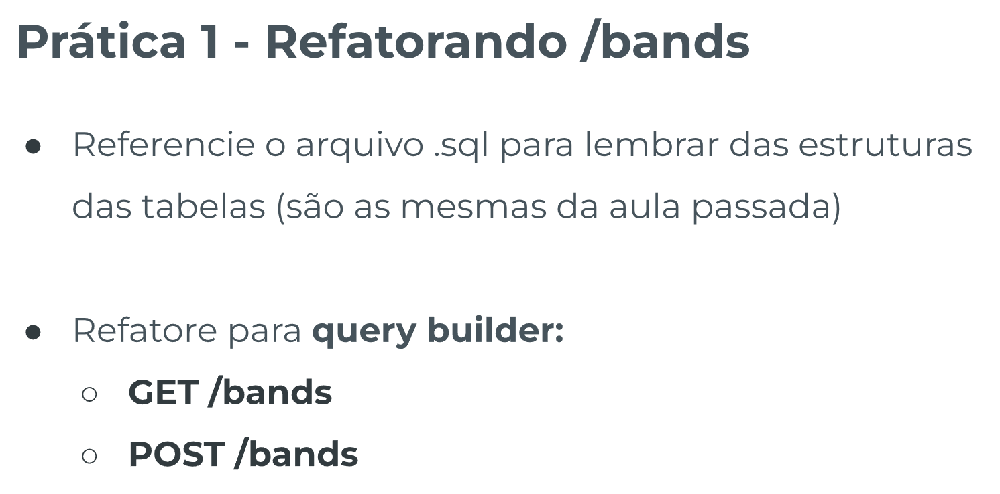
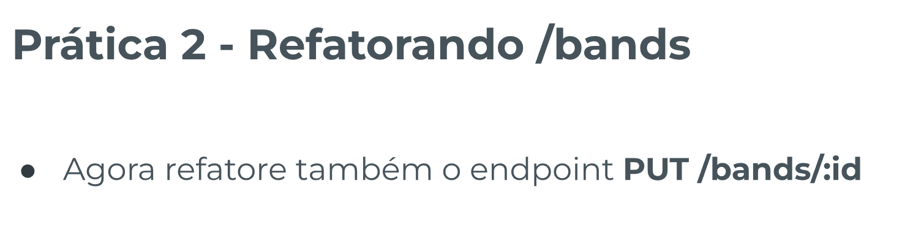
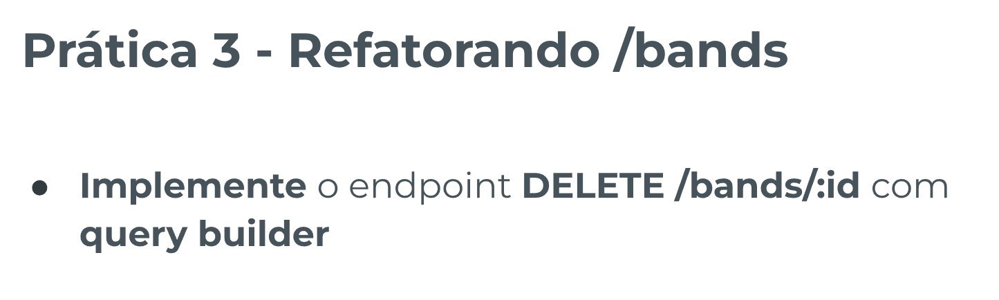
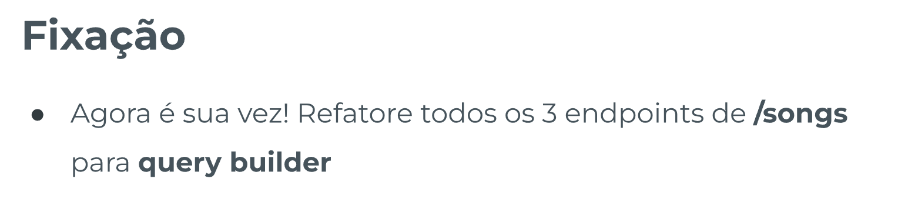

# Aprofundamento em Knex - Template de Prática

## Índice

-   [Prática Guiada 1](#prática-guiada-1)

    -   [Enunciado](#enunciado)
    -   [Resolução](#resolução)

-   [Prática Guiada 2](#prática-guiada-2)

    -   [Enunciado](#enunciado-1)
    -   [Resolução](#resoluc3a7c3a3o-1)

-   [Prática Guiada 3](#prática-guiada-3)

    -   [Enunciado](#enunciado-2)
    -   [Resolução](#resoluc3a7c3a3o-2)

-   [Fixação](#fixação)

    -   [Enunciado](#enunciado-3)
    -   [Resolução](#resoluc3a7c3a3o-3)

## Prática Guiada 1

### Enunciado



### Resolução:

`index.ts`

```ts
app.get('/bands', async (req: Request, res: Response) => {
    try {
        // const result = await db.raw(`
        //     SELECT * FROM bands;
        // `);

        // --
        // verboso:
        const result = await db.select('*').from('bands');
        // abreviado:
        // const result = await db('bands');
        // --
        res.status(200).send(result);
    } catch (error) {
        console.log(error);

        if (req.statusCode === 200) {
            res.status(500);
        }

        if (error instanceof Error) {
            res.send(error.message);
        } else {
            res.send('Erro inesperado');
        }
    }
});

app.post('/bands', async (req: Request, res: Response) => {
    try {
        const id = req.body.id;
        const name = req.body.name;

        if (typeof id !== 'string') {
            res.status(400);
            throw new Error("'id' inválido, deve ser string");
        }

        if (typeof name !== 'string') {
            res.status(400);
            throw new Error("'name' inválido, deve ser string");
        }

        if (id.length < 1 || name.length < 1) {
            res.status(400);
            throw new Error(
                "'id' e 'name' devem possuir no mínimo 1 caractere"
            );
        }

        // await db.raw(`
        //     INSERT INTO bands (id, name)
        //     VALUES ("${id}", "${name}");
        // `);

        // --
        // verboso:
        // await db
        //     .insert({
        //         id: id,
        //         name: name,
        //     })
        //     .into('bands');
        // abreviado:
        const newBand = {
            id: id,
            name: name,
        };
        await db('bands').insert(newBand);
        res.status(200).send('Banda cadastrada com sucesso');
    } catch (error) {
        console.log(error);

        if (req.statusCode === 200) {
            res.status(500);
        }

        if (error instanceof Error) {
            res.send(error.message);
        } else {
            res.send('Erro inesperado');
        }
    }
});
```

## Prática Guiada 2

### Enunciado



### Resolução:

`index.ts`

```ts
app.put('/bands/:id', async (req: Request, res: Response) => {
    try {
        const idToEdit = req.params.id;
        const newId = req.body.id;
        const newName = req.body.name;

        if (newId !== undefined) {
            if (typeof newId !== 'string') {
                res.status(400);
                throw new Error("'id' deve ser string");
            }

            if (newId.length < 1) {
                res.status(400);
                throw new Error("'id' deve possuir no mínimo 1 caractere");
            }
        }

        if (newName !== undefined) {
            if (typeof newName !== 'string') {
                res.status(400);
                throw new Error("'name' deve ser string");
            }

            if (newName.length < 1) {
                res.status(400);
                throw new Error("'name' deve possuir no mínimo 1 caractere");
            }
        }

        const [band] = await db('bands').where({ id: idToEdit });

        if (band) {
            // await db.raw(`
            //     UPDATE bands
            //     SET
            //         id = "${newId || band.id}",
            //         name = "${newName || band.name}"
            //     WHERE
            //         id = "${idToEdit}";
            // `);

            const updatedBand = {
                id: newId || band.id,
                name: newName || band.name,
            };

            await db('users').update(updatedBand).where({ id: idToEdit });
        } else {
            res.status(404);
            throw new Error("'id' não encontrada");
        }

        res.status(200).send({ message: 'Atualização realizada com sucesso' });
    } catch (error) {
        console.log(error);
        if (req.statusCode === 200) {
            res.status(500);
        }
        if (error instanceof Error) {
            res.send(error.message);
        } else {
            res.send('Erro inesperado');
        }
    }
});
```

## Prática Guiada 3

### Enunciado



### Resolução:

`index.ts`

```ts
app.delete('/bands/:id', async (req: Request, res: Response) => {
    try {
        const id = req.params.id;
        if (!id) {
            throw new Error('Por favor, informe um id válido');
        }

        const [band] = await db('bands').where({ id: id });
        if (band) {
            await db.del().from('bands').where({ id: id });
        } else {
            throw new Error('Id não encontrado');
        }

        res.status(200).send({ message: 'Banda excluída com sucesso' });
    } catch (error) {
        console.log(error);
        if (req.statusCode === 200) {
            res.status(500);
        }
        if (error instanceof Error) {
            res.send(error.message);
        } else {
            res.send('Erro inesperado');
        }
    }
});
```

## Fixação

### Enunciado



### Resolução:

`index.ts`

```ts
// =======> SONGS:

// CREATE:
app.post('/songs', async (req: Request, res: Response) => {
    try {
        const id = req.body.id;
        const name = req.body.name;
        const bandId = req.body.bandId;

        if (typeof id !== 'string') {
            res.status(400);
            throw new Error("'id' inválido, deve ser string");
        }

        if (typeof name !== 'string') {
            res.status(400);
            throw new Error("'name' inválido, deve ser string");
        }

        if (typeof bandId !== 'string') {
            res.status(400);
            throw new Error("'bandId' inválido, deve ser string");
        }

        if (id.length < 1 || name.length < 1 || bandId.length < 1) {
            res.status(400);
            throw new Error(
                "'id', 'name' e 'bandId' devem possuir no mínimo 1 caractere"
            );
        }

        // await db.raw(`
        //     INSERT INTO songs (id, name, band_id)
        //     VALUES ("${id}", "${name}", "${bandId}");
        // `);

        const newSong = {
            id: id,
            name: name,
            band_id: bandId,
        };
        await db('songs').insert(newSong);

        res.status(200).send('Música cadastrada com sucesso');
    } catch (error) {
        console.log(error);

        if (req.statusCode === 200) {
            res.status(500);
        }

        if (error instanceof Error) {
            res.send(error.message);
        } else {
            res.send('Erro inesperado');
        }
    }
});

// UPDATE:
app.put('/songs/:id', async (req: Request, res: Response) => {
    try {
        const idToEdit = req.params.id;

        const newId = req.body.id;
        const newName = req.body.name;
        const newBandId = req.body.bandId;

        if (newId !== undefined) {
            if (typeof newId !== 'string') {
                res.status(400);
                throw new Error("'id' deve ser string");
            }

            if (newId.length < 1) {
                res.status(400);
                throw new Error("'id' deve possuir no mínimo 1 caractere");
            }
        }

        if (newName !== undefined) {
            if (typeof newName !== 'string') {
                res.status(400);
                throw new Error("'name' deve ser string");
            }

            if (newName.length < 1) {
                res.status(400);
                throw new Error("'name' deve possuir no mínimo 1 caractere");
            }
        }

        if (newBandId !== undefined) {
            if (typeof newBandId !== 'string') {
                res.status(400);
                throw new Error("'name' deve ser string");
            }

            if (newBandId.length < 1) {
                res.status(400);
                throw new Error("'name' deve possuir no mínimo 1 caractere");
            }
        }

        // const [song] = await db.raw(`
        //     SELECT * FROM songs
        //     WHERE id = "${idToEdit}";
        // `); // desestruturamos para encontrar o primeiro item do array

        const [song] = await db('songs').where({ id: idToEdit });

        if (song) {
            // await db.raw(`
            //     UPDATE bands
            //     SET
            //         id = "${newId || band.id}",
            //         name = "${newName || band.name}"
            //     WHERE
            //         id = "${idToEdit}";
            // `);

            const updatedSong = {
                id: newId || song.id,
                name: newName || song.name,
                band_id: newBandId || song.band_id,
            };

            await db('songs').update(updatedSong).where({ id: idToEdit });

            if (song) {
                await db.raw(`
                UPDATE songs
                SET
                    id = "${newId || song.id}",
                    name = "${newName || song.name}",
                    band_id = "${newBandId || song.band_id}"
                WHERE
                    id = "${idToEdit}";
            `);
            } else {
                res.status(404);
                throw new Error("'id' não encontrada");
            }

            res.status(200).send({
                message: 'Atualização realizada com sucesso',
            });
        }
    } catch (error) {
        console.log(error);

        if (req.statusCode === 200) {
            res.status(500);
        }

        if (error instanceof Error) {
            res.send(error.message);
        } else {
            res.send('Erro inesperado');
        }
    }
});

// READ:
app.get('/songs', async (req: Request, res: Response) => {
    try {
        const result = await db('songs')
            .select(
                'songs.id AS idSong',
                'songs.name AS nameSong',
                'songs.band_id AS idBand',
                'bands.name AS bandName'
            )
            .from('songs')
            .innerJoin('bands', 'songs.band_id', '=', 'bands.id');

        res.status(200).send(result);
    } catch (error) {
        console.log(error);

        if (req.statusCode === 200) {
            res.status(500);
        }

        if (error instanceof Error) {
            res.send(error.message);
        } else {
            res.send('Erro inesperado');
        }
    }
});
```
